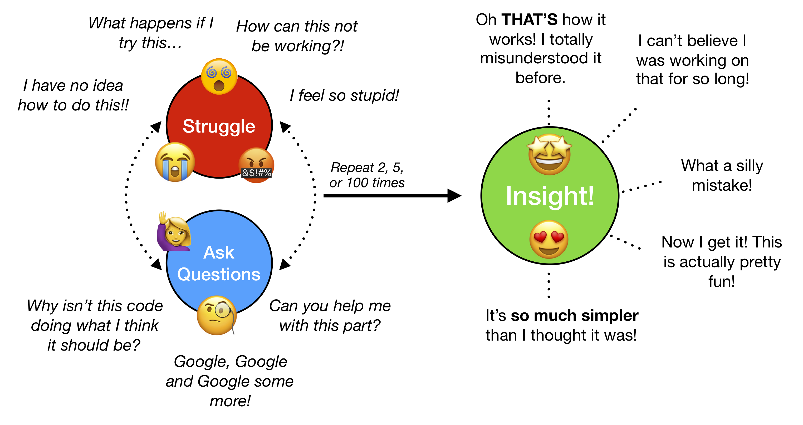
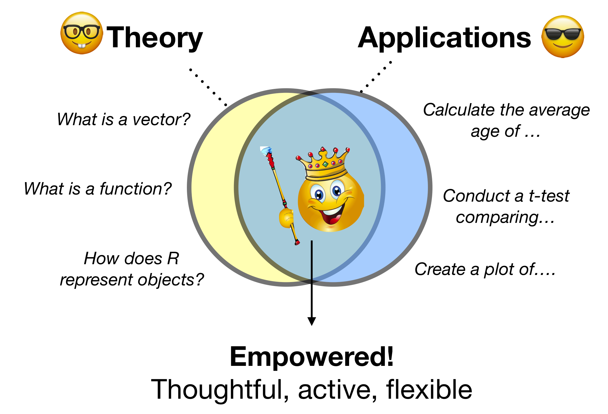
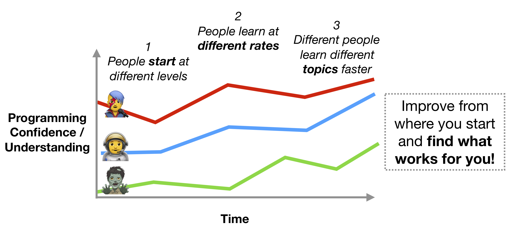
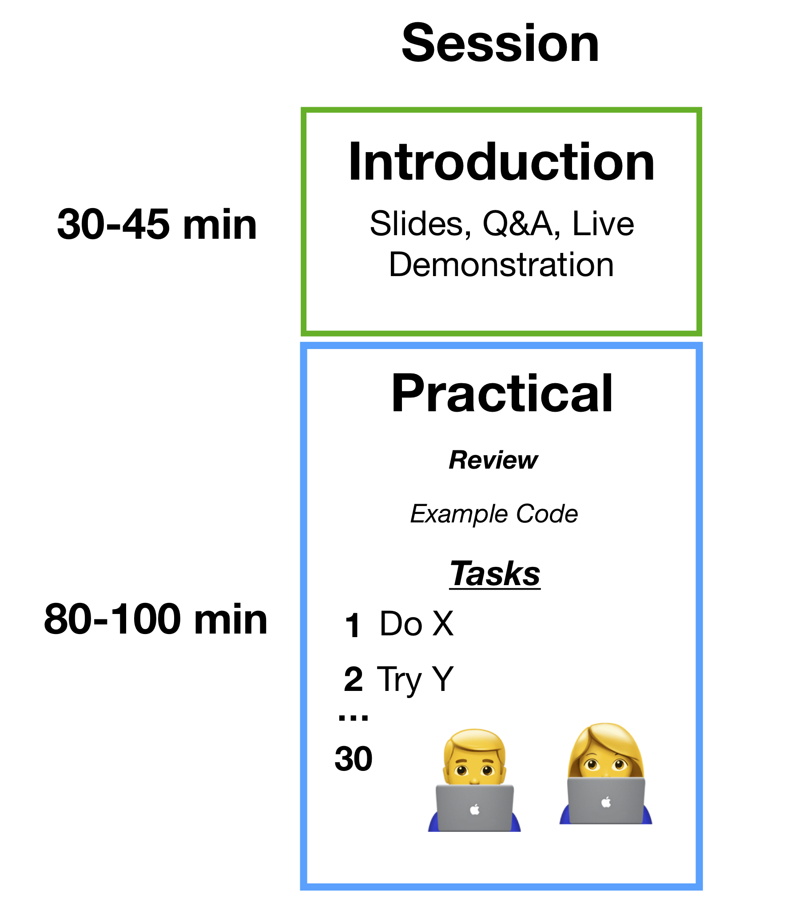
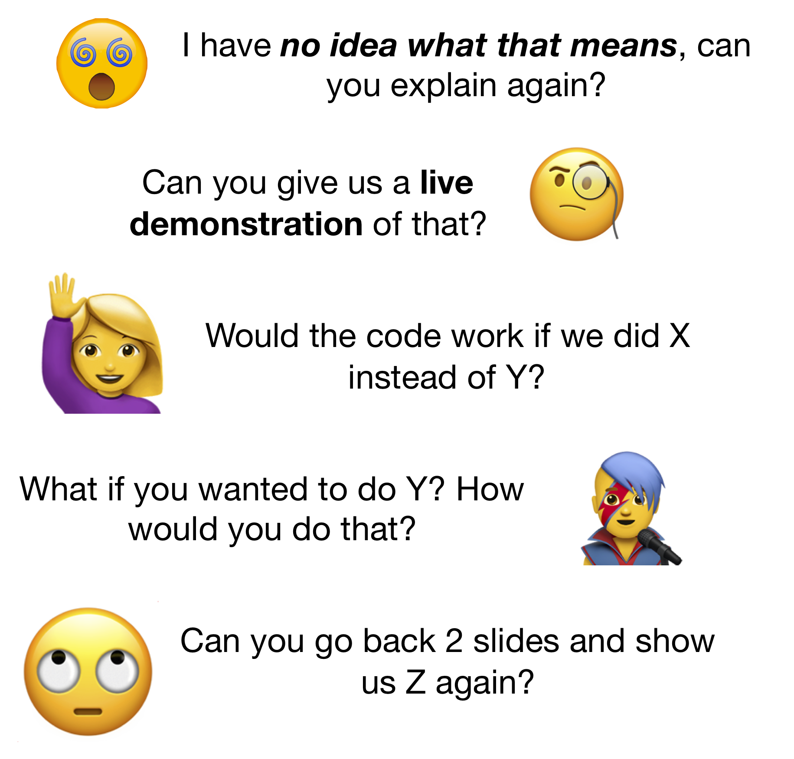
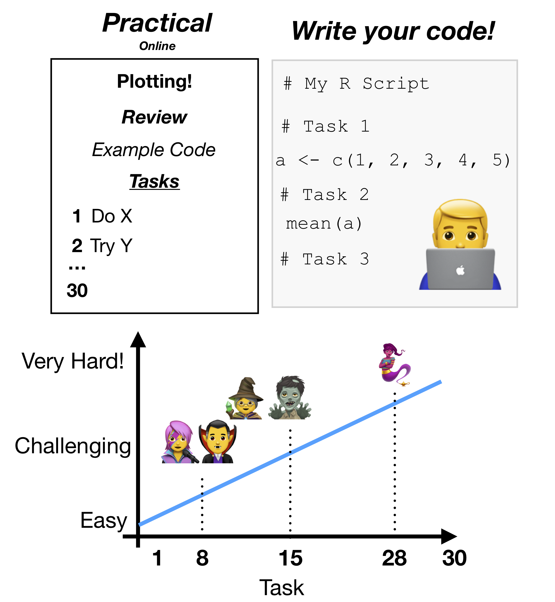
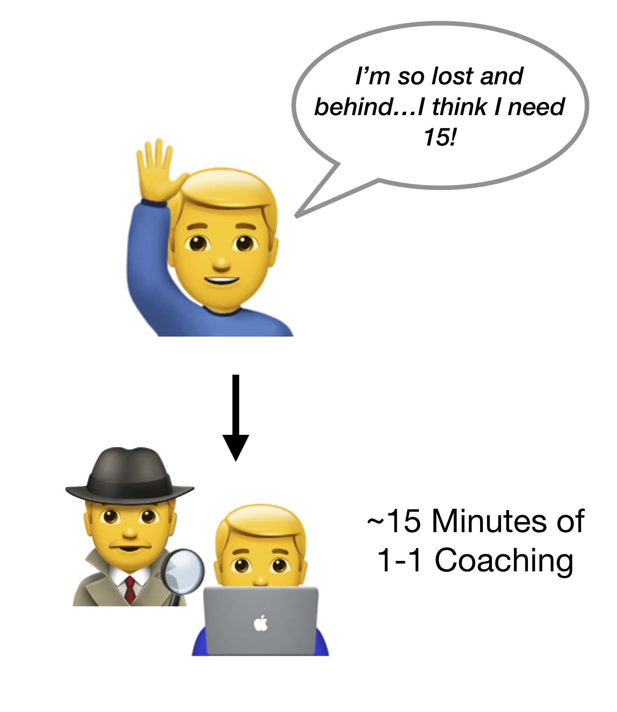

```{r, eval = FALSE, echo = FALSE}
# Code to knit slides
xaringan::inf_mr('_sessions/D1S0_Intro/Intro.Rmd')
```


```{r setup, include=FALSE}
options(htmltools.dir.version = FALSE)
options(width=110)
options(digits = 4)

knitr::opts_chunk$set(fig.align = 'center')
```


# Welcome!


<p align="center"></p>

---


.pull-left5[

#  Materials
<br><br>

<font size=6>Get all of the course materials through our homepage!</font><br><br>

<font size="6" color="#F62D73"><a href="www.therbootcamp.com"><b>www.therbootcamp.com</b></a></font><br><br>

<font size=6>Bookmark it :)</font><br><br>


<br>

<!---
### OR
<br>
<font size="6"> Direct <font size="6" color="#F62D73"><a href="bit.ly/BaselRBootcamp_April2018"><b>BaselRBootcamp_April2018</b></a></font>
--->


]

.pull-right5[

<p align="center"></p>


]


---

# Aim

.pull-left6[

>###<i>The aim of this workshop is enable you to thoughtfully and actively use R. We will communicate both the basics of the R language, as well as cutting-edge packages for wrangling, analyzing, and communicating statistical data.  

]

.pull-right4[
<p align="center"></p>

]

---


```{r, echo = FALSE, out.width = "80%"}

```


[Source: www.hackerearth.com](https://www.hackerearth.com/blog/innovation-management/open-innovation-principles/)


---
## Struggle, Ask questions (repeat!) -> Insight!

```{r, echo = FALSE}

```


---
### Theory + Applications = Empowered learning!

<font size = "6"></font>

```{r, echo = FALSE, out.width = "80%"}

```


---
## Everyone learns differently

```{r, echo = FALSE, out.width = "100%"}

```


---

.pull-left4[
# Schedule 

<font size = 5>We have a very intense and ambitious schedule!</font><br>

<font size = 5>The amount of material we will be covering in two short weekends is...crazy</font><br>

<font size = 5>The course is separated into different sessions</font><br>


### Two Tracks

<font size = 5>There is both a beginner and advanced track</font><br>

<font size = 5>Red sessions are generally more advanced than Gray sessions<br><br>


]

.pull-right55[


]

---

.pull-left45[

<br>
# Sessions

<font size = 5>Each focus session is 2 hours</font><br>

<font size = 5>Introduction lecture with slides</font><br>

<font size = 5>Hands-on programming practical</font><br>

]


.pull-right55[
```{r, echo = FALSE, out.width = "90%"}

```


]


---

.pull-left45[
<br><br>
# Introduction

<font size = 5>30 - 60 minute slide based introduction</font><br>

<font size = 5>Theory + code examples + live demonstrations</font><br>

<font size = 5>Goal: Help you understand the basic concepts</font><br>

<font size = 5>All available online! Follow along on your computer. Don't worry about memorizing.</font><br>

<font size = 5>Be interactive! Stop us and ask questions!</font><br>


]

.pull-right5[

### Be interactive!!
```{r, echo = FALSE}

```


]

---

.pull-left45[

# Practicals

<font size = 5>This is where you really learn how to program!</font><br>

<font size = 5>Anywhere from 10 ~ 30 programming tasks. Starts easy, gets progressively more challenging</font><br>

<font size = 5>Struggle, work together, <font color = 'blue'>ask questions</font> and challenge yourself</font><br>

<font size = 5>We are here to help! But won't make it too easy for you :)</font><br>

<font size = 5>You <font color = 'blue'>will not be able to finish all of the tasks</font>. That's ok!</font><br>

<font size = 5>Try to finish <b>50%</b> of the material during the session.</font><br>


]


.pull-right5[


```{r, echo = FALSE}

```


]


---

.pull-left5[
<br><br>
# ~15 min, 1-1 Coaching

<font size=5>Sometimes, you may find yourself in need of some intensive help. That's ok!</font><br><br>

<font size=5>That's ok! We're here to help!</font><br><br>

<font size=5>At <i><font color='blue'>any time</font></i>, you can request a 15 minute 1-1 intensive help / coaching session</font><br><br>

<font size=5>We'll find some space and help you with whatever you're struggling with</font>


]
 

.pull-right45[

```{r, echo = FALSE}

```


]


---
# Cheatsheets


<table width="100%" style="cellspacing:0; cellpadding:0; border:none">
  <tr>    
  <td>
  <p align = 'center'>RStudio IDE<br><br>
  <a href="https://github.com/rstudio/cheatsheets/raw/master/rstudio-ide.pdf"></a></p>
  </td>
 
  <td>
   <p align = 'center'>Base R<br><br>
  <a href="http://github.com/rstudio/cheatsheets/raw/master/base-r.pdf"></a></p>
  </td>  
  
  <td> 
   <p align = 'center'>Data Import<br><br>
  <a href="https://github.com/rstudio/cheatsheets/raw/master/data-import.pdf"></a></p>
  </td>
  
  <td>
  <p align = 'center'>Data Transformation<br><br>
  <a href="https://github.com/rstudio/cheatsheets/raw/master/data-transformation.pdf"></a></p>
  </td>

  <td>
  <p align = 'center'>Data Visualization<br><br>
  <a href="https://github.com/rstudio/cheatsheets/raw/master/data-visualization-2.1.pdf"></a></p>
  </td>
  

  </tr>
</table>
<br>


---

.pull-left4[

<br><br>
# Breaks

<font size = 5>Feel free to take breaks when you need them!</font><br2>

<font size = 5>Help yourself to refreshments</font><br>

<font size = 5>Coffee machine nearby (1 CHF)</font><br>

<font size = 5>Lunch on your own or together at Tibits</font><br>

]


.pull-right6[

<p align='center'><br><br><br><font size="6"><b><a href="https://www.tibits.ch/de/restaurants.html#tibits-basel">Tibits</a><br>
</p>

]


---

.pull-left35[
# Introductions

<font size = 5>1. What is your name?</font>
<br><br>
<font size = 5>2. Where are you from?</font>
<br><br>
<font size = 5>3. What is your programming experience?</font>
<br><br>
<font size = 5>4. Why do you want to learn R?</font>
<br><br>
<font size = 5>5. Coffee or tea?</font>
<br><br>
<font size = 5>6. Pizza or pasta?</font>
<br><br>
<font size = 5>7. Beer or wine?</font>
<br><br>
<font size = 5>8. Berlin or Paris?</font>
]

.pull-right6[
<br><br>
<p align="center"></p>

]


---
<br>
<p align="center"></p>

---
# Session 1: What is R?


<p><font size=6><b><a href="https://therbootcamp.github.io/BaselRBootcamp_2018April/_sessions/D1S1_WhatIsR/What_is_R.html#1">Link to Session 1: What is R?</a>


---
# Backup slides


