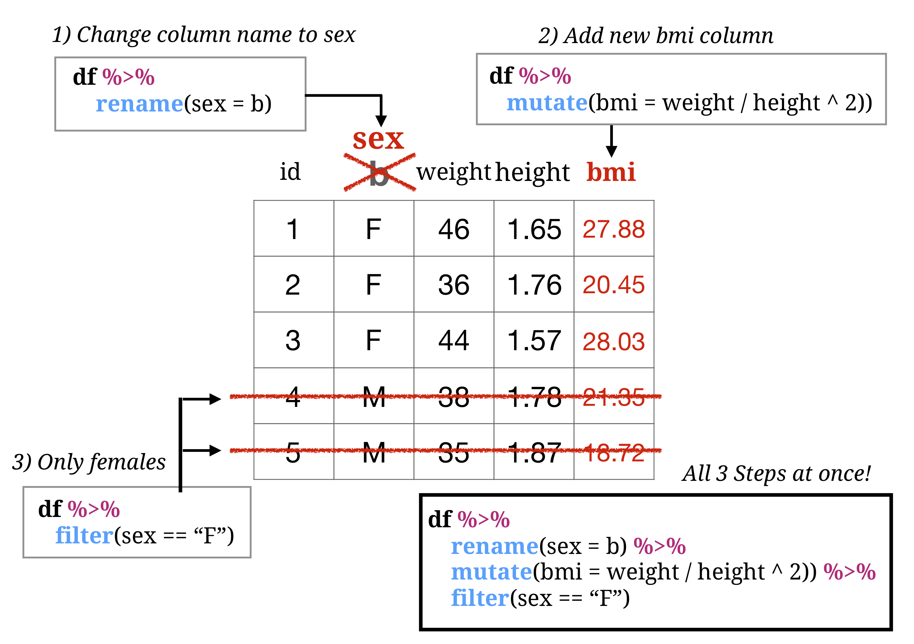

```{r, echo = FALSE}
knitr::opts_chunk$set(comment=NA, fig.width=6, fig.height=6, echo = FALSE, eval = FALSE, warning = FALSE)
```

```{r, echo = FALSE, fig.align = 'center', eval = TRUE, out.width = "70%"}

```

### Overview

In this practical you'll practice "data wrangling" with the `dplyr` and `tidyr` packages (part of the `tidyverse collection of packages).

By the end of this practical you will know how to:

1. Change column names, select specific columns
2. Create new columns based on existing ones
3. Select specific rows of data based on multiple criteria
4. Group data and calculate summary statistics
5. Combine multiple data sets through key columns
6. Convert data between wide and long formats

### Cheatsheet

Data wrangling with dplyr and tidyr

- Data wrangling with dplyr and tidyr Cheatsheet: [https://www.rstudio.com/wp-content/uploads/2015/02/data-wrangling-cheatsheet.pdf](https://www.rstudio.com/wp-content/uploads/2015/02/data-wrangling-cheatsheet.pdf).

### Glossary

Here are the main functions you will be using in `dplyr`:

| Function| Description | Example |
|:---|:----------------------|:--------------------------------------|
|     `filter()`|    Select rows based on some criteria| data %>% filter(age > 40 & sex == "m")|
|     `arrange()`|    Sort rows| data %>% arrange(date, group)|
|     `select()`|    Select columns.| data %>% select(age, sex)<br>data %>% select(age, sex, everything())|
|     `rename()`|    Rename columns| data %>% rename(new = old)|
|     `mutate()`|    Add new columns| data %>% mutate(height.m = height.cm / 100)|
|     `case_when()`|    Recode values of a column| data %>% mutate(sex_n = case_when(sex == 0 ~ "m", sex == 1 ~ "f"))|
|     `group_by(), summarise()`|   Group data and then calculate summary statistics|data %>% group_by(...) %>% summarise(...)|
|     `left_join()`|   Combine multiple data sets using a key column|data %>% left_join(data2, by = "id")|

Here are the two functions you will be using from the `tidyr` package:

| Function| Description| Example |
|:---|:----------------------|:--------------------------------------|
|     `spread()`|    Convert long data to wide format - from rows to columns| data %>% gather(time, data, -id)
|     `gather()`|    Convert wide data to long format - from columns to rows|data %>% spread(time, data)

### Examples

The following examples will take you through the steps of doing data wrangling with dplyr. Try to go through each line of code and see how it works!

```{r, eval = FALSE, echo = TRUE}
# -----------------------------------------------
# Examples of using dplyr on the baselers data
# ------------------------------------------------

library(tidyverse)         # Load tidyverse for dplyr and tidyr
library(skimr)

# Load baselers data
baselers <- read_csv("https://raw.githubusercontent.com/therbootcamp/baselers/master/inst/extdata/baselers.txt")

# Skim the data
skim(baselers)

baselers <- baselers %>%
  
  # Change some names
  rename(age_y = age,
         swimming = rhine) %>%
  
  # Only include people over 30
  filter(age_y > 30) %>%
  
  # Calculate some new columns
  mutate(weight_lbs = weight * 2.22,
         height_m = height / 100,
         BMI = weight / height_m ^ 2,
         
         # Make binary version of sex
         sex_bin = case_when(
                      sex == "male" ~ 0,
                      sex == "female" ~ 1,
                      TRUE ~ NA_real_),

        # Show when height is greater than 150
        height_lt_150 = case_when(
          height < 150 ~ 1,
          height >= 150 ~ 0,
          TRUE ~ NA_real_
        ) %>%
  
  # Sort in ascending order of sex, then
  #  descending order of age
  arrange(sex, desc(age_y)))


# Calculate grouped summary statistics

baselers_agg <- baselers %>%
  group_by(sex, education) %>%
  summarise(
    age_mean = mean(age_y, na.rm = TRUE),
    income_median = median(income, na.rm = TRUE),
    N = n()
  )
```


### Packages

|Package| Installation|
|:------|:------|
|`tidyverse`|`install.packages("tidyverse")`|


### Datasets

```{r, eval = TRUE, message = FALSE}
library(tidyverse)
trial_act <- read_csv("../_data/day_1/trial_act.csv")
trial_act_demo <- read_csv("../_data/day_1/trial_act_demo_fake.csv")
```

|File | Rows | Columns |
|:----|:-----|:------|
|`trial_act.csv` | 2139 | 27 |
|`trial_act_demo_fake`| 2139 | 3|

# Tasks

## Getting setup

A. Open your R project. It should already have the folders `0_Data` and `1_Code`. Make sure that the `trial_act.csv` and `trial_act_demo_fake.csv` files are in your `1_Data` folder

```{r}
# Done!
```

B. Open a new R script and save it as a new file called `wrangling_practical.R` in the `2_Code` folder. At the top of the script, using comments, write your name and the date. Then, load the set of packages for this practical with `library()`. Here's how the top of your script should look:

```{r, eval = FALSE, echo = TRUE}
## NAME
## DATE
## Wrangling Practical

library(XX)     
library(XX)
#...
```

```{r, message = FALSE, warning = FALSE, echo = FALSE, eval = TRUE}
library(tidyverse)
library(speff2trial)
library(skimr)
```

C. For this practical, we'll use the `trial_act` data, this is the result of a randomized clinical trial comparing the effects of different medications on adults infected with the human immunodeficiency virus. Using the following template, load the data into R and store it as a new object called `trial_act`.

```{r, echo = TRUE, eval = FALSE, message = FALSE, warning = FALSE}
# Load trial_act.csv from the data folder in your working directory

trial_act <- read_csv(file = "XXX/XXX")
```

D. Using the same code structure, load the `trial_act_demo_fake.csv` data as a new dataframe called `trial_act_demo_fake`

```{r, echo = FALSE, eval = FALSE, message = FALSE, warning = FALSE}
trial_act <- read_csv(file = "https://raw.githubusercontent.com/therbootcamp/BaselRBootcamp2017/master/tutorials/data/trial_act.csv")
```

```{r, message = FALSE, echo = FALSE, eval = TRUE, warning = FALSE}
library(tidyverse)
```

E. The `trial_act` data is actually a copy of a dataset from the `speff2trial` package called `ACTG175`. Look at the help menu for the `ACTG175` data by running `?ACTG175` (If you become really interested in the data, you can also read an article discussing the trial here: [http://www.nejm.org/doi/full/10.1056/nejm199610103351501#t=article](http://www.nejm.org/doi/full/10.1056/nejm199610103351501#t=article))

```{r, echo = TRUE, eval = FALSE}
# Look at documentation for ACTG175 data (contained in the speff2trial package)
?ACTG175
```

F. Take a look at the first few rows of the datasets by printing them to the console.

```{r, eval = FALSE, echo = TRUE}
# Print trial_act object
trial_act
```

G. Use the `skim()` function (from the `skimr` package) to get more details on the datasets.

```{r}
skim(trial_act)
```

## Notes

In this practical you'll be doing lots of sequential operations on the same data. Whenever you can, try to keep the pipe `%>%` going to connect each task to the one before it. See below for an example

```{r, echo = TRUE, eval = FALSE}

# Version A) Try to convert this...

baselers <- baselers %>% rename(age_y = age)
baselers <- baselers %>% rename(swimming = rhine)
baselers <- baselers %>% filter(age_y > 30)

# Version B) To this version where you keep the pipe going from the beginning!

baselers <- baselers %>% 
  
  rename(age_y = age,
         swimming = rhine) %>%
  
  filter(age_y > 30)
```

### Change column names with rename()

1. Let's change some of the column names in `trial_act`. Using `rename()`, change the column name `wtkg` to `weight_kg` (to specify that weight is in kilograms) Be sure to assign the result back to `trial_act` to change it!

2. Change the column name `age` to `age_y` (to specify that age is in years).

```{r}
trial_act <- trial_act %>%
  rename(weight_kg = wtkg,
         age_y = age)
```

### Select columns with select()

3. Using the `select()` function, create a new dataframe called `CD4_wide` that *only* contains the columns `pidnum`, `arms`, `cd40`, `cd420`, and `cd496`. The `cd40`, `cd420`, and `cd496` columns show patient's CD4 T cell counts at baseline, 20 weeks, and 96 weeks. Print the result to make sure it worked!

4. Did you know you can easily select all columns that start with specific characters using `starts_with()`? Try adapting the following code to get the same result you got before.

```{r, echo = TRUE, eval = FALSE}
CD4_wide <- trial_act %>% 
  select(pidnum, arms, starts_with("XXX"))
```


### Add new columns with mutate()

5. Using the `mutate()` function, add the following two new columns to `trial_act`. Try combining these into *one* call to the mutate() function!
    - `agem`: Each patient's age in months instead of years (Hint: Just multiply `age_y` by 12!).
    - `weight_lb`: Weight in lbs instead of kilograms. You can do this by multiplying `weight_kg` by 2.2.
    - `cd_change_20`: Change in CD4 T cell count from baseline to 20 weeks. You can do this by taking `cd420 - cd40`
    - `cd_change_960`: Change in CD4 T cell count from baseline to 96 weeks. You can do this by taking `cd496 - cd40`

```{r}
trial_act <- trial_act %>% 
  mutate(agem = age_y * 12)
```

#### mutate(case_when())

6. Create a new column `gender_char` that shows gender as a character string. To do this, use a combination of `mutate()` and `case_when`. The original gender data is stored in the `gender` column, where 0 = "female" and 1 = "male".
    
```{r}
trial_act <- trial_act %>%
  mutate(
  gender_char = case_when(
    gender == 0 ~ "female",
    gender == 1 ~ "male"
  )
  )
```

7. Create a new column `over50` that is 1 when patients are older than 50, and 0 when they are younger than or equal to 50 (hint: Use logical comparisons > and <=)

```{r}
trial_act <- trial_act %>%
  mutate(
  over50 = case_when(
    agey > 50 ~ 1,
    agey <= 50 ~ 0
  )
  )
```

8. If you haven't already, put the code for your previous questions in one call to `mutate()`. That is, in one block of code, create `agem`, `weight_lb`, `cd_change_20`, `cd_change_960`, `gender_char` and `over50` using the `mutate()` function only once. Here's how your code should look:

```{r, eval = FALSE, echo = TRUE}
trial_act <- trial_act %>%
  mutate(
    agem = XXX,
    weight_lb = XXX,
    cd_change_20 = XXX,
    cd_change_960 = XXX,
    gender_char = case_when(XXX),
    over50 = case_when(XXX)
  )
```

### Arrange rows with arrange()

9. Using the `arrange()`function, arrange the `trial_act` data in ascending order of `age_y` (from lowest to highest). After you do, look the data to make sure it worked!

```{r}
trial_act <- trial_act %>% 
 arrange(agey)

trial_act
```

10. Now arrange the data in *descending* order of `age_y` (from highest to lowest). After, look the data to make sure it worked. To arrange data in descending order, just include `desc()` around the variable. E.g.; `data %>% arrrange(desc(height))`

```{r}
trial_act <- trial_act %>% 
 arrange(desc(agey))

trial_act
```

11. You can sort the rows of dataframes with multiple columns by including many arguments to `arrange()`. Now sort the data by arms (`arms`) and then age (`age_y`).

```{r}
trial_act <- trial_act %>% 
 arrange(arms, agey)

trial_act
```


### Filter specific rows with `filter()`

12. Using the `filter()` function, create a new dataframe called `trial_act_m` that only contains data from males (`gender_char == "male"`)

```{r}
trial_act_B <- trial_act %>%
  filter(gender == 1)
```

13. A colleague of yours named Tracy wants a datafame only containing data from females over the age of 40. Create this dataframe with `filter()` and call it `trial_act_Tracy`

```{r}
trial_act_C <- trial_act %>%
  filter(agey > 40 & gender == 0)
```

### Combine dataframes with `left_join()`

```{r, echo = FALSE, eval = FALSE, message = FALSE}
trial_act_demo <- read_csv("https://raw.githubusercontent.com/therbootcamp/therbootcamp.github.io/master/_sessions/_data/patient_demo.csv")

trial_act_demo
```

14. The `trial_act_demo_fake.csv` file contains additional (fictional) demographic data about the patients, namely the number of days of exercise they get per week, and their highest level of education. Use the `left_join()` function to combine the `trial_act` and `trial_act_demo_fake` datasets, set the `by` argument to the name of the column that is common in both data sets. This will be the key! Assign the result to `trial_act`. When you are done, look at the `trial_act` dataframe to make sure your code worked!

```{r, echo = TRUE, eval = FALSE}
trial_act <- trial_act %>%
  left_join(XX, by = XXX)
```

15. Using your new `trial_act` dataframe, which should contain the exercise data, calculate the mean number of days of exercise that patients reported.

```{r}
mean(trial_act$exercise)
```

### Calculate grouped statistics with `group_by()` and `summarise()`

16. In this code we'll calculate summary statistics for each of the trial arms. Start with the `trial_act` dataframe. Then, group the data by `arms`. Then, for each arm, calculate the mean participant age (in years) as a new column called `age_mean`. Also, using `N = n()`, calculate the number of cases for each group. Assign the result to a new object called `trial_arm`.

```{r, eval = FALSE}
trial_act %>% 
  group_by(arms) %>%
  summarise(
    age_mean = mean(agey)
  )
```

17. Now adjust your previous code to calculate the standard deviation of age *in addition* to the mean.

```{r}
trial_act %>% 
  group_by(arms) %>%
  summarise(
    age_mean = mean(agey),
    karnof_median = median(karnof)
  )
```

18. Add code to calculate the median number of days until the first major negative event (`days`) for each arm.

19. Your code so far only creates groups based on `arm`, now adjust the code so it creates groups based on `gender_char` *only* (that is, forget about the trial arm). Keep calculating all of the same summary statistics as you did before. Assign the result to a new dataframe called `trial_gender`

20. Now group the data by *both* `arm` and `gender_char` and calculate the same summary statistics! Assign the result to a new object called `trial_arm_gen`

### Reshaping with gather() and spread()

21. Remember the `CD4_wide` dataframe you created before? Currently it is in the wide format, where key data (different CD4 T cell counts) are in different columns. Now we will try to convert it to a long format. Our goal is to get the data in the 'long' format. Using the `spread()` function, create a new dataframe called `CD4_long` that shows the data in the 'long' format. To do this, use the following template. Set the grouping column to `time` and the new data column to `value`. 

```{r, echo = TRUE, eval = FALSE}
CD4_long <- CD4_wide %>% 
  gather(XX,  # New grouping column
         XX,  # New data column
         -pidnum, -arms)  # Names of columns to replicate
```

22. Now that your data are in the wide format, it should be easy to calculate grouped summary statistics! For each time point and trial arm, calculate the mean CD4 T cell count using `group_by()` and `summarise()`.

23. Now it's time to practice moving data from the long to the wide format. Using the following template, use the `spread()` function to convert `CD4_long` *back the wide format*. Assign the result to a new object called `CD4_wide_2`. It should look *exactly* like `CD4_wide`!

```{r, echo = TRUE, eval = FALSE}
CD4_wide_2 <- CD4_long %>% 
  spread(XX,   # old group column
         XX)   # old target column
```

### Play around with "Scoped" functions

Many common dplyr functions like `mutate()` and `summarise()` have 'scoped' versions with suffixes like `_if` and `_all`. that allow you do some pretty cool stuff easily (look at the help menu with `?scoped` for details). Try running the following chunk with `summarise_if()` and see what happens:

```{r, eval = FALSE, echo = TRUE}
# See how summerise_if() works!
baselers %>%
  group_by(sex) %>%
  summarise_if(is.numeric, mean)
```

24. Now, in the `trial_act` dataset, group the data by `arm` and calculate the mean of all numeric columns using `summerise_if()`

Here's another scoped function in action `mutate_if()` in action:

```{r, eval = FALSE, echo = TRUE}
# use mutate_if() to round all numeric variables to 2 digits
baselers %>%
  mutate_if(is.numeric, round, 2)
```

25. Using `mutate_if()`, round all of your results from the previous question to 0 decimal places (to the nearest integer)


### More practice

26. Now let's check the major differences between the treatment arms. For each arm, calculate the following:

   - Mean days until a a major negative event (`days`)
   - Mean CD4 T cell count at baseline. (`cd40`)
   - Mean CD4 T cell count at 20 weeks. (`cd420`)
   - Mean CD4 T cell count at 96 weeks. (`cd496`)
   - Mean *change* in CD4 T cell count between baseline and 96 weeks
   - Number of patients in each arm

```{r}
trial_act %>%
  group_by(arms) %>%
  summarise(
    days_mean = mean(days),
    cd4_bl = mean(cd40),
    cd4_20 = mean(cd420),
    cd4_96 = mean(cd496, na.rm = TRUE),
    cd4_change = mean(cd496 - cd40, na.rm = TRUE),
    N = n()
  )
```

27. Repeat the previous analysis, but before you do the grouping and summary statistics, create a new variable called `arms_char` that shows the values of `arms` as characters that reflect what the values actually represent (hint: use `mutate()` and `case_when()`). For example, looking at the help file `?ACTG175`, I can see that the treatment arm of 0 is "zidovudine". I might call this arm `"Z"`. Do this in the all in the same chunk of code.

```{r}
trial_act %>%
  mutate(
    arms_char = case_when(
      arms == 0 ~ "Z",
      arms == 1 ~ "ZD",
      arms == 2 ~ "ZZ",
      arms == 3 ~ "D"
    )
  ) %>%
  group_by(arms_char) %>%
  summarise(
    days_mean = mean(days),
    cd4_bl = mean(cd40),
    cd4_20 = mean(cd420),
    cd4_96 = mean(cd496, na.rm = TRUE),
    cd4_change = mean(cd496 - cd40, na.rm = TRUE)
  )
```

28. Create the following dataframe that shows patient's mean CD8 T cell count (from columns `cd80` and `cd820`), where the data are grouped by time and trial arm. (Hint: use the following functions in order: select(), gather(), mutate(), group_by(), summarise())

```{r, eval = TRUE}
trial_act %>%
  mutate(
    arms_char = case_when(
      arms == 0 ~ "Z",
      arms == 1 ~ "ZD",
      arms == 2 ~ "ZZ",
      arms == 3 ~ "D"
    )
  ) %>% 
  select(pidnum, arms_char, starts_with("cd8")) %>%
  gather(time, measure, -pidnum, -arms_char) %>%
  mutate(time = case_when(time == "cd80" ~ "baseline",
                          time == "cd820" ~ "week 20")) %>%
  group_by(time, arms_char) %>%
  summarise(N = n(),
            cd8_mean = mean(measure),
            cd8_median = median(measure))
```


