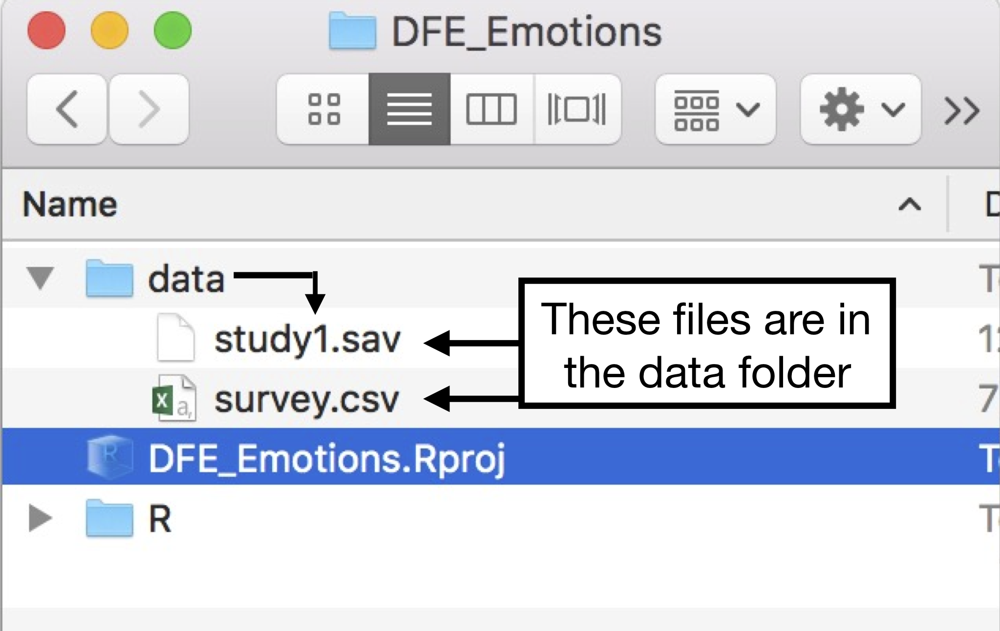
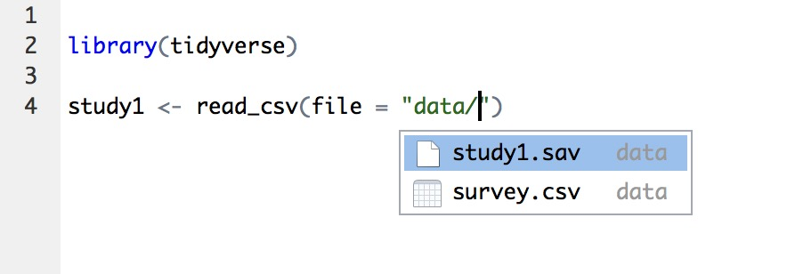
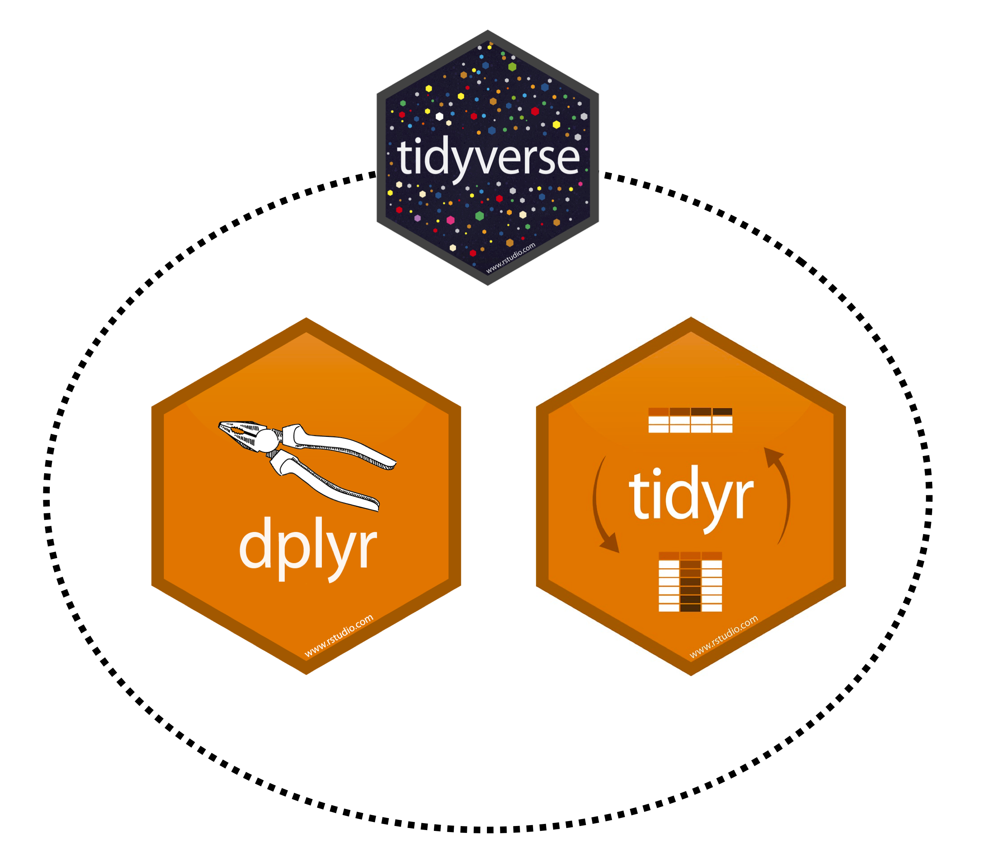
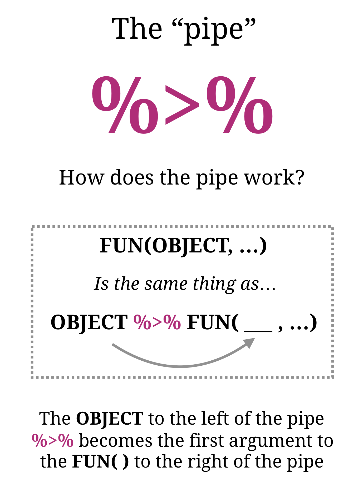
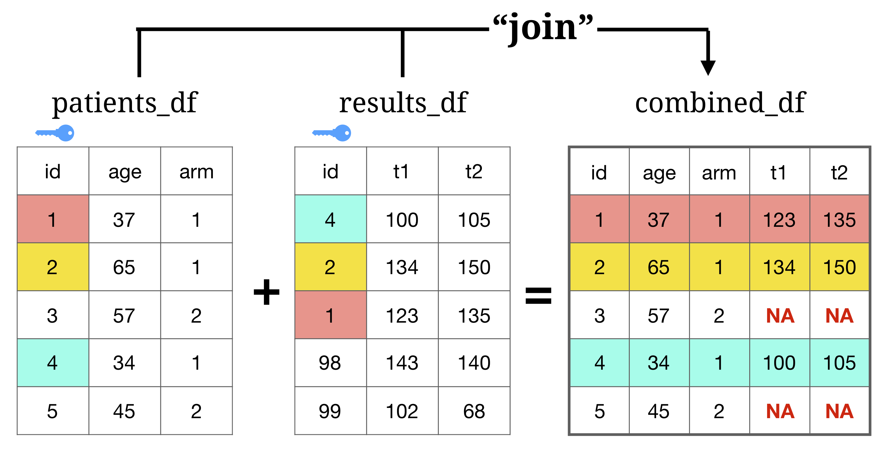

```{r, eval = FALSE, echo = FALSE}
# Code to knit slides
xaringan::inf_mr('_sessions/D2S1_Wrangling/Wrangling.Rmd')
baselers <- read_csv("https://raw.githubusercontent.com/therbootcamp/baselers/master/inst/extdata/baselers.txt")
```


```{r setup, include=FALSE}
options(htmltools.dir.version = FALSE)
options(width=110)
options(digits = 4)
library(tidyverse)
```


.pull-left4[

<font size = 6>Two main topics today</font>

1. Get your external data into R

2. 


]


.pull-right55[


]


---

.pull-left45[
## Data input - Paths

<font size = 4>When using R projects, paths are always relative to the location of your project folder</font></br>


<font size = 4>If all of your data files are in your project folder (or a subfolder), the path will be easy to find</font></br>


```{r, echo = FALSE, out.width = "100%"}

```


<font size = 4>Note: You <i>can</i> load files from other locations on your computer, but you shouldn't (for reproducibility reasons)</font></br>
]

.pull-right5[

### Example)

```{r, eval = FALSE}
# Create survey dataframe from
#    survey.csv (Comma-separated csv)

survey <- read_csv(file = "data/survey.csv")

# Create study1 dataframe from
#    study1.sav (SPSS file)

survey <- read_spss(file = "data/study1.sav")
```


Tip! Press the tab key to view a list of all files in the directory!

```{r, echo = FALSE, out.width = "80%", fig.align = 'center'}

```


Look at help menus for additional arguments

```{r, eval = FALSE}
# Look at help menu for read_csv function
?read_csv
```


]


---

## Data input - Web

<font size = 4>You can easily load files directly from the web by specifying the URL as the path</font></br>


```{r, message = FALSE}
# Save file URL as fires_url (it's pretty long)
fires_url <- "https://archive.ics.uci.edu/ml/machine-learning-databases/forest-fires/forestfires.csv"

# Load as new dataframe called fires
fires <- read_csv(file = fires_url)

# Look at result!
print(fires)
```


---
.pull-left4[
<br><br>
## Where you're at...

<font size = 5>0) Loaded packages (like tidyverse!) with <font color = 'blue'>library()</font><br>

<font size = 5>1) Created a new dataframe (df) from external files using a data input function such as <br>df <font color='red'><-</font> <font color='blue'>read_csv</font>()</font><br>

<font size = 5>2) You can explore the dataframe with functions like <font color = 'blue'>View</font>(), <font color = 'blue'>dim</font>() and <font color = 'blue'>names</font>()

<font size = 5>3) You can explore the dataframe and calculate descriptive statistics on specific columns using <font color = 'blue'>FUN</font>(df<font color='red'>$</font><font color = 'green'>NAME</font>)</font><br>

]


.pull-right55[

<br>
```{r, eval = FALSE}
# Step 0) Load libraries

library(tidyverse)

# Step 1) Read file called baslers.txt 
#  in a data folder with read_csv()
#  and save as new object baslers

baslers <- read_csv(file = "data/baslers.txt")

# Step 2) Explore data

View(baslers)   # Open in new window
dim(baslers)    # Show number of rows and columns
names(baslers)  # Show names

# Step 3) Calculate descriptives on named colums

mean(baslers$age)   # What is the mean age?
table(baslers$sex)  # How many of each sex?

# Step 4) ...

```

What's next?... <font size = 7>Wrangling!</font>

]


---
.pull-left5[

# What is Wrangling?

Transform
- Adding new columns
- Combining columns
- Splitting columns

Organise
- Moving data between columns and rows
- Merging several dataframes
- Sorting data by columns

Aggregation
- Aggregate data according to variables
- Summarizing data across groups

]


.pull-right5[

```{r, echo = FALSE, out.width = "100%", fig.align = 'center'}
knitr::include_graphics("https://raw.githubusercontent.com/therbootcamp/therbootcamp.github.io/master/_sessions/_image/organise_transform_aggregate.png")
```

]

---

.pull-left45[
<br><br>
<font size = 6>To wrangle data in R, we will use the dplyr and tidyr packages</font>


```{r, echo= TRUE, eval = FALSE}

# Load packages individually

# install.packages('dplyr')
# install.packages('tidyr')

library(dplyr)
library(tidyr)

# Or just use the tidyverse!

# install.packages('tidyverse')

library(tidyverse)
```

]
 
.pull-right5[
<br>
<br><br>
```{r, echo = FALSE, out.width = "100%", fig.align = 'center'}

```
]

---

# %>%    "The Pipe!"

.pull-left35[
 
<font size = 6>dplyr makes extensive use of a new operator called the "Pipe" <b><font color='purple'>%>%</font></b></font><br><br>

<font size = 6>The "Pipe" <b><font color='purple'>%>%</font></b> is used to pass objects from one function to another</font><br><br>

<font size = 6>You can read the "Pipe" <b><font color='purple'>%>%</font></b> as "And Then..."</font><br><br>


<br>


]

.pull-right65[
<br>

<font size = 6><center><b>object</b> %>%   <i><font color='gray'>"And then..."</font></i></center></font><br>
<font size = 6><center><b>FUN1()</b> %>%  <i><font color='gray'>"And then..."</font></i></center></font><br>
<font size = 6><center><b>FUN2()</b> %>%  <i><font color='gray'>"And then..."</font></i></center></font><br>
<font size = 6></center></font><br>


]


---

.pull-left45[

```{r, echo = FALSE, out.width = "95%"}

```


]

.pull-right5[

## Example)

```{r}
# Create a vector score
score <- c(8, 4, 6, 3, 7, 3)
```


<font size = 5>Q) Calculate the mean score</font>

```{r}
# Base-R method

mean(score)

# Pipe %>% method

score %>%  # Take the vector score AND THEN 
  mean()   # calculate the mean
```

]


---

.pull-left45[

```{r, echo = FALSE, out.width = "95%"}

```


]

.pull-right5[

## Example)

```{r}
# Create a vector score
score <- c(8, 4, 6, 3, 7, 3)
```

<font size = 5>Q) Calculate the standard deviation and round to 1 digit</font>

```{r}
# Base-R method

round(sd(score), digits = 1)

# Pipe %>% method

score %>%        # Take vector score AND THEN
  sd() %>%       # Calculate the sd AND THEN
  round(digits = 1) # Round to 1 digit
```


]


---

.pull-left4[
<br><br>
## Functions in dplyr

<font size = 5>There are dozens (hundreds?) functions in dplyr that allow you to wrangle data.</font><br>

<font size = 5>For an overview, look at the <a href='https://www.rstudio.com/wp-content/uploads/2015/02/data-wrangling-cheatsheet.pdf'>cheatsheet!</a></font><br>

<font size = 5>We will now show you how to use ~10 of the most common functions</font><br>

]


.pull-right55[

<br>

<br>
```{r, echo = FALSE, out.width="600", fig.align = 'center'}
knitr::include_graphics("../_image/dplyr_functions.png")
```

]


---

.pull-left45[
<br>
### How dplyr looks in action

<br>
> <font size = 4>From the <b>baselers</b> data...<br><br>1) <b>Change the name</b> of the column 'age' to 'age_years' and 'weight' to 'weight_kg'.<br><br>2), <b>only include</b> people younger than 40.<br><br>3) <b>Add a new column</b> called that shows people's debt divided by their income.<br><br>4) Create <b>groups</b> based on sex.<br><br>5) <b>Calculate summary statistics</b>: the mean income, debt, and debt ratio for each group.</font>


]

.pull-right55[
<br>
### Translating to dplyr


```{r, eval = FALSE}
# Assign result to baslers_agg

baslers_agg <- baselers %>% 
  
  # Change column names with rename()
  rename(age_years = age,
         weight_kg = weight)  %>% # PIPE!

  # Select specific rows with filter()
  filter(age_years < 40)  %>% # PIPE!
  
  # Create new columns witb mutate()
  mutate(debt_ratio = debt / income)  %>% # PIPE!
  
  # Group data with group_by()
  group_by(sex) %>% # PIPE!
  
  # Calculate summary statistics with summarise()
  summarise(income_mean = mean(income),
            debt_mean = mean(debt),
            dr_mean = mean(dr))
```

]


---

.pull-left4[

<br>

### dplyr notes

<br>


<font size = 4>Start by assigning your result to a new object to save it!</font><br><br>

<font size = 4>"Keep the pipe <font color = 'purple'>%>%</font> going" to continue working with your dataframe</font><br><br>

<font size = 4>The output of dplyr functions will (almost) always be a tibble</font><br><br>

<font size = 4>You can almost always include multiple operations within each function</font><br><br>

]

.pull-right55[
<br>
### Translating to dplyr

 
```{r, eval = FALSE}
# Assign result to baslers_agg

baslers_agg <- baselers %>% 
  
  # Change column names with rename()
  rename(age_years = age,
         weight_kg = weight)  %>% # PIPE!

  # Select specific rows with filter()
  filter(age_years < 40)  %>% # PIPE!
  
  # Create new columns witb mutate()
  mutate(debt_ratio = debt / income)  %>% # PIPE!
  
  # Group data with group_by()
  group_by(sex) %>% # PIPE!
  
  # Calculate summary statistics with summarise()
  summarise(income_mean = mean(income),
            debt_mean = mean(debt),
            dr_mean = mean(dr))
```

]


---


```{r, echo = FALSE}
patients_df <- tibble(id = c(1, 2, 3, 4, 5),
                      b = c(37, 65, 57, 34, 45),
                      c = c(1, 1, 2, 1, 2))

results_df <- tibble(id = c(4, 2, 1, 98, 99),
                    t1 = c(100, 134, 123, 143, 102),
                    t2 = c(105, 150, 135, 140,68))
```


.pull-left4[
# Transformation Functions

| Function| Description|
|:-------------|:----|
| `rename()` | Change column names |
| `mutate()`|   Create a new column from existing columns|
| `case_when()`|  Recode values from a vector to another|
| `left_join()` | Combine multiple dataframes| 

]

.pull-right55[
<br><br><br><br>
### patients_df
```{r}
patients_df   # Demographic data
```


]


---


.pull-left3[
# rename() 


<font size = 5> Change column names with rename()<br><br></font>
<font size = 5>New = Old, <br>New = Old, ...<br><br></font>

```{r}
patients_df  # Original
```
]

.pull-right65[
<br><br>
<font size = 5>Create better column names with rename()</font>

```{r}
# 0) Start with patients_df data
patients_df <- patients_df %>% 

# 1) Change column names with rename()
  rename(age = b,  # New = Old
         arm = c)  # New = Old
```

]

---

.pull-left3[
# mutate() 

<font size = 4>Add new columns (or change existing ones) with mutate()<br><br></font>
<font size = 4>Define new columns in terms of existing columns in the dataframe<br><br></font>
<font size = 4>Can add multiple new columns within one mutate()<br><br></font>
<font size = 4>Change an existing column by assigning it to itself<br><br></font>


```{r, eval = FALSE}
df %>%
  mutate(
   NEW1 = DEFINITION1,
   NEW2 = DEFINITION2,
   NEW3 = DEFINITION3,
   ...
  )
```
]

.pull-right65[
<br><br>

<font size = 5>Add new columns with mutate()</font>

```{r}
patients_df <- patients_df %>% 

# Create new columns with mutate()
  mutate(age_months = age * 12,
         age_decades = age / 10)
```

]


---

.pull-left35[
## mutate(x = case_when())

<font size = 4>Use case_when() in combination with mutate() to define new columns based on logical conditions<br><br></font>

<font size = 4>Useful for recoding values from one set to another<br><br></font>

|arm|arm_char|
|:--|:--|
|0|"placebo"|
|1|"drug"|
|1|"drug"|
|0|"placebo"|

```{r, eval = FALSE}
# Using case_when()

df %>%
  mutate(
    NEW = case_when(
      COND1 ~ VAL1,
      COND2 ~ VAL2
    ))
```
]

.pull-right6[
<br><br>

<font size = 5>3) Recode values with case_when()</font>

```{r}
patients_df <- patients_df %>% 

# Create new columns with mutate()
  mutate(age_months = age * 12,
         age_decades = age / 10,
         arm_char = case_when(arm == 0 ~ "placebo",
                              arm == 1 ~ "drug")
         )
```

]

---
# Joining data
 

```{r, echo = FALSE, out.width = "95%"}

```


---

.pull-left35[
## left_join()
<br>

<font size = 4>Use left_join() to combine data from 2 dataframes based on one or more keuy columns<br><br></font>

<font size = 4>Each dataset must contain the 'key' column(s)<br></font>

```{r, eval = FALSE}
# Join df2 to df1
#   using KEY as the key column
df1 %>%
  left_join(df2, 
      by = c("KEY"))
```

```{r, echo = FALSE, out.width = "90%", fig.align = 'center'}

```


]

.pull-right6[
<br>
<font size = 5>Join patients_df with results_df to create combined_df</font>

```{r}
combined_df <- patients_df %>% 
  
# Join with results_df with left_join()
  left_join(results_df, by = "id")

# Look at all column names
names(combined_df)

# Show a few columns
combined_df %>%
  select(id, arm, age, t1, t2)
```

]


---


.pull-left35[
<br><br>
# Notes

<font size = 4> Don't forget to start by assigning to a new (or existing) object with <- </font><br><br>

<font size = 4> Keep adding new functions connected by the pipe %>%</font>

<font size = 4> Order matters! You can refer to new columns in later code </font>
<br><br>


]

.pull-right6[
<br><br>
Create combined_df using multiple functions connected with the pipe %>%

```{r, eval = FALSE}
# 0) Start with patients_df data
combined_df <- patients_df %>%
  
# 1) Change column names with rename()
  rename(age = b,  
         arm = c) %>%
  
# 2) Create new columns with mutate()
  mutate(age_months = age * 12,
         age_decades = age / 10,
         arm_char = case_when(arm == 0 ~ "placebo",
                              arm == 1 ~ "drug")
         ) %>%
  
# 3) Add data from results_df with left_join()
  left_join(results_df, by = "id")
```


]

---
.pull-left4[

# Organisation Functions

Organisation functions help you shuffle your data by sorting rows by columns, filter rows based on criteria, select columns (etc.)

| Function| Purpose|Example|
|:-------------|:----|:-----|
| `arrange()` |Sort rows by columns|`df %>% arrange(arm, desc(age))`|
| `filter()` | Select specific rows |`df %>% filter(age > 50)`|
| `select()`|   Select specific columns|`df %>% select(arm, t1)`|

]


.pull-right55[

<br><br>
```{r}
combined_df %>%
  arrange(arm, desc(age)) %>%
  filter(age > 50) %>%
  select(arm, age, t1, t2)
```


]


---

.pull-left3[
# arrange()

<font size = 5>The arrange() function is used to sort (aka, arrange) rows of a dataframe</font>
<br><br>
<font size = 5>You can sort by as many conditions as you want</font>
<br><br>
<font size = 5>To sort in descending order, use desc()</font>


]

.pull-right65[

<br><br>

<font size = 5>1) Sort rows by id then in descending order of age</font>

```{r}

# 0) Start with combined_df data
combined_df %>%
  
# 1) Sort by id then age (descending)
  arrange(id, desc(age))
```

]


---

.pull-left3[
# filter()

<font size = 5>The filter() function is used to select specific rows</font>
<br><br>
<font size = 5>For complex conditions, chain multiple logical comparison operators<br><br>(==, !=, <, >, <=, >=, &, |)</font>


]

.pull-right65[
<br><br>

<font size = 5>2) Select drugtrial over 30</font>

```{r}

# 0) Start with combined_df data
combined_df %>%
  
# 1) Sort by id then age (descending)
  arrange(id, desc(age)) %>%
  
# 2) Only drugtrial over 30
  filter(arm_char == "drug" & age > 30)
```

]


---

.pull-left3[
# select()


<font size = 5>Keep columns with <br><br>select(COL1, COL2, ...)<font>
<br>
<font size = 5>Remove columns with <br><br> select(-COL1, -COL2, ...)<font>
<br>


]

.pull-right65[

<br><br>

<font size = 5>3) Remove age_months and age_decades</font>

```{r}

# 0) Start with combined_df data
combined_df %>%
  
# 1) Sort by id then age (descending)
  arrange(id, desc(age)) %>%
  
# 2) Only drugtrial over 30
  filter(arm_char == "drug" & age > 30) %>%
  
# 3) Remove age_months and age_decades
  select(-age_months, -age_decades)
  
```

]


---
.pull-left4[

# Aggregation functions

| Function| action|
|:-------------|:----|
| `group_by()` |Group data by levels of specific variables |
| `summarise()` | Calculate summary statistics |

### Statistical functions

| Function| action|
|:-------------|:----|
| `min(), max()`| Minimum, maximum |
| `mean(), median()` |Mean, Median |
| `sd()` |Standard deviation|
| `sum()` | Sum|
| `n()`| Number of cases|
]

.pull-right55[
<br><br>

```{r, echo = FALSE}
combined_df <- combined_df %>%
  select(id, age, arm_char, t1, t2) %>%
  rename(arm = arm_char)
```

```{r}
combined_df
```

### Goal:

- Group data by arm
- Calculate summary statistics from t1 and t2

]


---
.pull-left3[
# group_by() 

<font size = 5>Used to combine data into groups<font>
<br><br>
<font size = 5>You can group by as many variables as you wish<font>
<br><br>
<font size = 5>You won't see any changes to the data until you use summarise()<font>
<br>

]

.pull-right65[

<br><br>


<font size = 5>1) Group data by arm</font>

```{r}
# 0) Start with combined_df data
combined_df %>%
  
# 1) Group data by arm with group_by
  group_by(arm)
```

]


---
.pull-left4[
# summarise() 

<font size = 5>Used to summarise data from groups<br><br>
<font size = 5>Works like mutate() to create new variables, but with summary functions<font>
<br>

```{r, eval = FALSE}
df %>%
  group_by(VAR1) %>%
  summarise(
    SUMMARY = FUN(x),       # 
    age_mean = mean(age),   # Ex 1
    height_min = min(height) # Ex 2 
    total = n()
  )
```


]

.pull-right55[
<br><br>

<font size = 5>2) Calculate summary statistics from times</font>

```{r}
# 0) Start with combined_df data
combined_df %>%
  
# 1) Group data by arm with group_by
  group_by(arm) %>%
  
# 2) Calculate summary columns
  summarise(
    t1_mean = mean(t1),
    t2_mean = mean(t2),
    diff = t2_mean - t1_mean,
    N = n()  # Number of rows in group
  )
```

]


---

.pull-left45[

## Reshaping data

<font size = 5>There are two key functions in the `tidyr` package (part of the `tidyverse`) that allow you to 'reshape' a dataframe between <font color = 'blue'>'wide'</font> and <font color = 'blue'>'long'</font> formats.</font><br>

<font size = 5><font color = 'blue'>'Wide'</font> dataframes have key data in <font color = 'blue'>separate columns</font>, <font color = 'blue'><br><br>'Long'</font> dataframes have key data in <font color = 'blue'>separate rows</font>.</font><br>

<font size = 5>Why reshape? Some functions (like dplyr) require data to be in a certain shape.</font><br>

#### Two key tidyr functions

| Function | Result |
|:----------|:-------|
|`gather()`|Move data from 'wide' to 'long' format|
|`spread()`|Move data from 'long' to 'wide' format|

]

.pull-right5[
<br><br>

### 'Wide' vs. 'Long' data

```{r, echo = FALSE}
stock_w <- data.frame(id = c("a", "b", "c"),
                 t1 = c(10, 20, 15),
                 t2 = c(20, 26, 30))

stock_l <- stock_w %>% 
  gather(time, measure, -id)
```

```{r}
# Wide format
stock_w
```


```{r}
# Long format
stock_l
```


]


---

.pull-left45[

### gather()

<font size=5>Use `gather()` to convert wide to long</font>

```{r}
# Show wide data
stock_w
```

```{r}
# "Gather" wide data to long
stock_w %>% 
  gather(time,    # New group column
         measure, # New target column
         -id)     # ID column
```

]

.pull-right5[

## spread()

<font size=5>Use `spread()` to convert long to wide</font>

```{r}
# Show long data
stock_l
```


```{r}
# "Spread" long data to wide
stock_l %>% 
  spread(time,    # Old group column
         measure) # Old target column
```


]

---

.pull-left4[

#dplyr summary

dplyr is great for elegantly performing sequential operations on data.

The 'pipe' operator `%>%` helps you string multiple *objects* (like dataframes) and *verbs* (summarise, order, aggregate...) together.

```{r, echo = FALSE, out.width = "50%", fig.align = 'center', eval= FALSE}
knitr::include_graphics("https://raw.githubusercontent.com/therbootcamp/therbootcamp.github.io/master/_sessions/_image/dplyr_hex.png")
```

]

.pull-right5[

<br>
<br>

Basic structure of dplyr commands:

```{r, eval = FALSE}
data %>%    # Start with data, AND THEN...
  VERB1 %>% # Do VERB1, AND THEN...
  VERB2 %>% # Do VERB2, AND THEN...
  VERB3 %>% # Do VERB3, AND THEN...
  group_by(x, y) %>%  # Group by variables x, y
    summarise(
      VAR_A_New = fun(trial),
      VAR_B_New = fun(Y)
    )
  )
```

]


---

.pull-left3[

## Important!

<br>

<font size = 5>You can call many dplyr functions directly without the pipe %>%</font>
<br><br><br>

<font size = 5>However, we recommend always using the pipe %>% so you can string many operations together</font>

]


.pull-right65[

<br><br>
<font size = 5> Use the pipes %>%!</font>
```{r, eval = FALSE}
## Using dplyr functions without pipes %>%
##     Avoid this if you can

data <- mutate(data, age_years = age_months * 12)
data <- filter(data, sex == "m")

## Using dplyr functions with pipes %>%
##    Much better!!!

data <- data %>% mutate(age_years = age_months * 12)
data <- data %>% filter(sex == "m")

# Why? Because with pipes you can easily put multiple
#  functions together if you choose.

data <- data %>% 
          mutate(age_years = age_months * 12) %>%
          filter(sex == "m") %>%
   # ....
```


]


---

# Live Demo & Practical

<br><br><br>
<p><font size=6><b><a href="https://therbootcamp.github.io/BaselRBootcamp_2018April/_sessions/D2S1_Wrangling/Wrangling_practical.html">Link to Wrangling practical</a>


---

# Additional Slides

---
# Vector functions

```{r, echo = FALSE, out.width="900", fig.align = 'center'}
knitr::include_graphics("https://raw.githubusercontent.com/therbootcamp/therbootcamp.github.io/master/_sessions/_image/vector_functions.png")
```

---

.pull-left5[
# Vector to scaler functions

- Each takes a numeric vector `x`, and returns a numeric scaler

| Function| action|
|:-------------|:----|
|     `sum(x)`, `prod(x)`|   Sum or product|
|     `min(x), max(x)`|    Minimum, maximum|
|     `mean(x), median(x)`|    Arithmetic mean or median| 
|     `var(x)`, `sd(x)`|   Variance, standard deviation|

]

.pull-right45[
<br>

### Examples

```{r}
# Sum of all weights?
sum(ChickWeight$weight)

# Mean weight?
mean(ChickWeight$weight)

# Standard deviation of weights?
sd(ChickWeight$weight)
```

]


---

.pull-left5[
# Vector to vector / table functions

- Each takes a numeric vector `x`, and returns a vector or table

| Function| action|
|:-------------|:----|
|     `unique(x)`|   What are the unique values of x?|
|     `table(x)`|    How many are there of each unique value in x?|
|     `rank(x)|    What is the rank order of values in x?|


]

.pull-right45[
<br>

### Examples

```{r}
# Sum of all weights?
sum(ChickWeight$weight)

# Mean weight?
mean(ChickWeight$weight)

# Standard deviation of weights?
sd(ChickWeight$weight)
```

]


---

.pull-left4[
# dplyr

dplyr is a combination of 3 things:

1. **`objects`** like dataframes
2. **`verbs`** that **do** things to objects.
3. **`pipes`** `%>%` that string together objects and verbs

<br>


```{r, echo = FALSE, out.width = "70%", fig.align = 'center'}
knitr::include_graphics("https://raw.githubusercontent.com/therbootcamp/therbootcamp.github.io/master/_sessions/_image/pipe.jpg")
```

]

.pull-right5[

<br>
<br>
<br>

```{r, echo = FALSE, out.width = "70%", fig.align = 'center'}
knitr::include_graphics("https://raw.githubusercontent.com/therbootcamp/therbootcamp.github.io/master/_sessions/_image/sequential.png")
```

dplyr is meant to be sequential and work like language

> Take data trial, 
>   then do Y, 
>   then do Z,
>   ...

]


---

.pull-left4[
# dplyr

### Question:

> <font size=5>From the ChickWeight dataframe, calculate the mean weight and time for each diet</font>

]


.pull-right55[

### Answer:
```{r, message = FALSE, warning = FALSE}
library(dplyr)

x <- ChickWeight %>%  # Start with ChickWeight
  group_by(Diet) %>%  # Group by Diet
  summarise(          # Get ready to summarise....
    weight.mean = mean(weight), # Mean weight
    time.mean = mean(Time),     # Mean time
    N = n()                     # Number of cases
  )
  

x
```

]


---


# Common dplyr verbs

| verb| action| example |
|:---|:----|:----------------|
|     `filter()`|    Select rows based on some criteria| `filter(age > 40 & treatment == "drug")`|
|     `arrange()`|    Sort rows| `arrange(date, group)`|
|     `select()`|    Select columns (and ignore all others)| `select(age, treatment)`|
|     `rename()`|    Rename columns| `rename(DATE_MONTHS_trial24, date`)|
|     `mutate()`|    Add new columns| `mutate(height.m = height.cm / 100)`|
|     `case_when()`|    Recode values of a column| `treat_char = case_when(treatment == 0 ~ "placebo", treatment == 1 ~ "drug")`|
|     `group_by(), summarise()`|   Group data and then calculate summary statistics|`group_by(treatment) %>% summarise(...)` |


---

#### Example 1

*Add a column called `weight_d_time` that is weight divided by time*

```{r, message = FALSE, warning = FALSE}
library(dplyr)

x <- ChickWeight %>%          # Start with the ChickWeight data
      mutate(                 # Create new columns...
            weight_d_time = weight / Time
            )

head(x)   # Print the result
```


---

#### Example 2

*Add a column called `weight_d_time` that is weight divided by time AND `time_d` that is time in days*

```{r, message = FALSE, warning = FALSE}
x <- ChickWeight %>%          # Start with the ChickWeight data
      mutate(                 # Create new columns...
            weight_d_time = weight / Time,  # weight_d_time is weight divided by Time
            time_d = Time * 7               # time_d is Time times 7
            )

head(x)   # Print the result
```

---


### Recoding values with case_when()

.pull-left4[
Recoding values is a common data wrangling task. You can easily do this with `case_when()`:

```{r, eval = FALSE}
data %>%
  mutate(
  var_new = case_when(
    var_old == OLD_A ~ NEW_A,
    var_old == OLD_B ~ NEW_B
  )
```

For example, in a dataset, the column `sex` might be coded with 1s and 0s.

You might want to create a new column `sex_new` where 1 = "female" and 0 = "male":

| sex| sex_new|
|------:|----:|
|    1|   "female"|
|    0|   "male"|

]

.pull-right5[

To change the value of 1 to `"female"`, and 0 to `"male"`, you can use `case_when()`:

```{r, eval = FALSE}
# Add a column sex_new to data 

data <- data %>% 
  mutate(
        sex_new = case_when(
          arm == 1 ~ "drug",
          arm == 0 ~ "placebo"
        )
  )
```


You can think about the code above as follows:

- Create a new column `sex_new` where
    - If `sex == 1`, then set the value to `"female"`
    - If `sex == 0`, then set the value to `"male"`

]

---

.pull-left4[

#### Example 3

*Create a new variable Diet_name which shows Diet in text format. Here is a table of the values*

| Diet| Diet_name|
|------:|----:|
|    1|   "fruit"|
|    2|   "vegetables"|
|    3|   "meat"|
|    4|   "grains"|

]

.pull-right5[
<br>
<br>
```{r, message = FALSE, warning = FALSE, eval = TRUE}

ChickWeight <- ChickWeight %>%           # Start with the ChickWeight data
                 mutate(
                   Diet_name = case_when(
                     Diet == 1 ~ "fruit",
                     Diet == 2 ~ "vegetables",
                     Diet == 3 ~ "meat",
                     Diet == 4 ~ "grains"
                   )
   
 )

head(ChickWeight)
```

]

---

#### Example 4

*For each Diet, calculate the mean weight*

```{r, message = FALSE, warning = FALSE}
ChickWeight %>%           # Start with the ChickWeight data
  group_by(Diet) %>%      # Group the data by Diet
  summarise(              # Now summarise....
    weight.mean = mean(weight) # Mean weight
  )
```

---

#### Example 5

*For each time period less than 10, calculate the mean weight*

```{r, message = FALSE, warning = FALSE}
ChickWeight %>%                # Start with the ChickWeight data
  filter(Time < 10) %>%        # Only Time periods less than 10
  group_by(Time) %>%           # Group the data by Diet
  summarise(                   # Now summarise....
    weight.mean = mean(weight) # Mean weight
  )
```

---
#### Example 6

*For each Diet, calculate the mean weight, maximum time, and the number of chicks on each diet*:

```{r, message = FALSE, warning = FALSE}
ChickWeight %>%           # Start with the ChickWeight data
  group_by(Diet) %>%      # Group the data by Diet
  summarise(              # Now summarise....
    weight.mean = mean(weight), # Mean weight
    time.max = max(Time),       # Max time
    N = n()                     # Number of observations
  )
```

---

# Other dplyr verbs

| verb| action| example |
|:---|:----|:----------------|
|     `sample_n()`|    Select a random sample of n rows| `sample_n(10)`|
|     `sample_frac()`|    Select a random fraction of rows| `sample_frac(.20)`|
|     `first(), last()`|    Give the first (or last) observation| `first(), last()`|

---

#### Example 7

*Give me a random sample of 10 rows from the ChickWeight dataframe, but only show me the values for Chick and weight*

```{r}
# Give me a random sample of 10 rows, but only show me columns Chick and weight

ChickWeight %>% 
  select(Chick, weight) %>%
  sample_n(10)
```

---
.pull-left4[

#dplyr

dplyr operations (almost) always return a dataframe which you can assign to a new object:

> *Create a dataframe with the average weight for each time period and nothing else!!*

]

.pull-right5[
<br>
<br>
```{r}
# Create a new object called time_agg

time_agg <- ChickWeight %>%
  group_by(Time) %>%
  summarise(
    weight.mean = mean(weight)
  )

head(time_agg)
```

]


