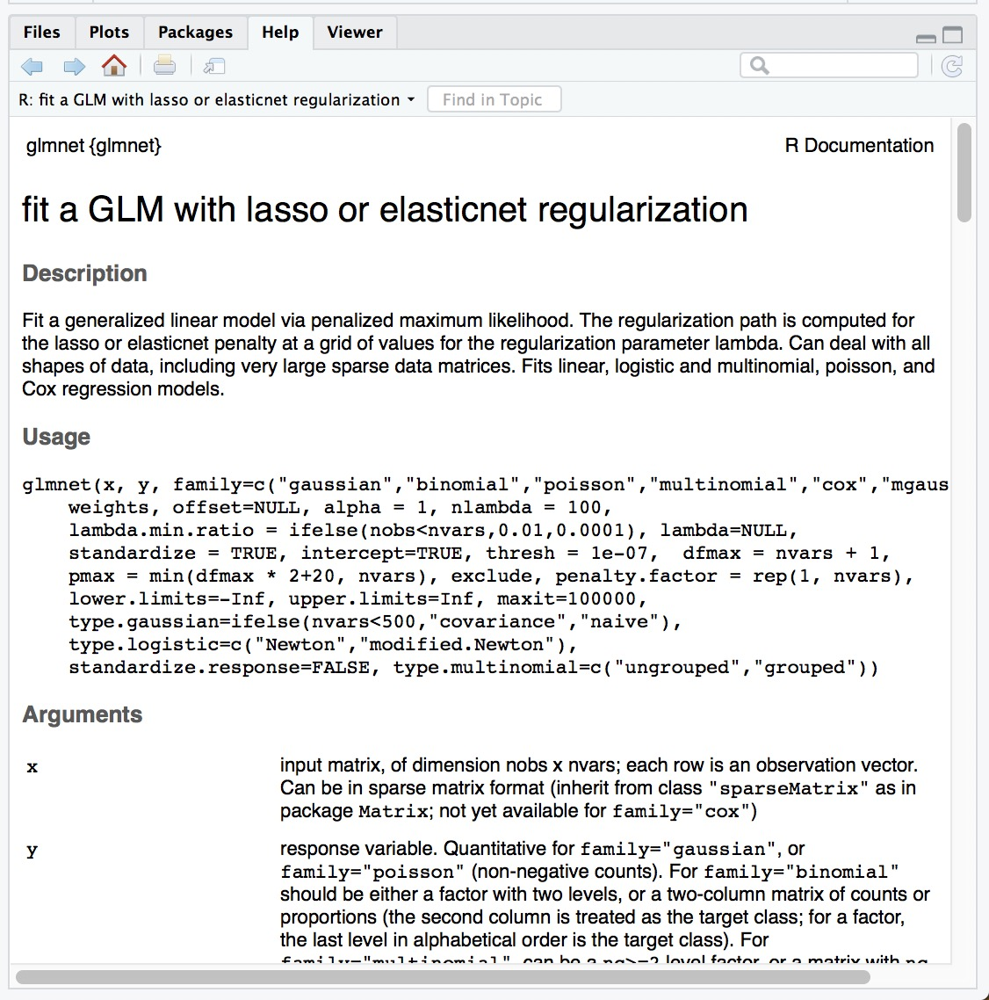
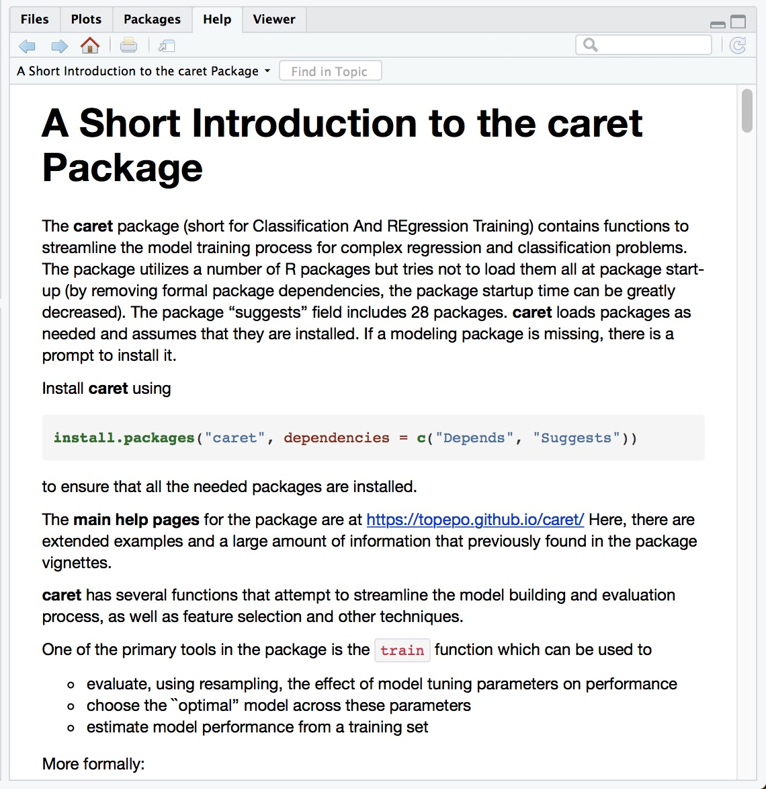
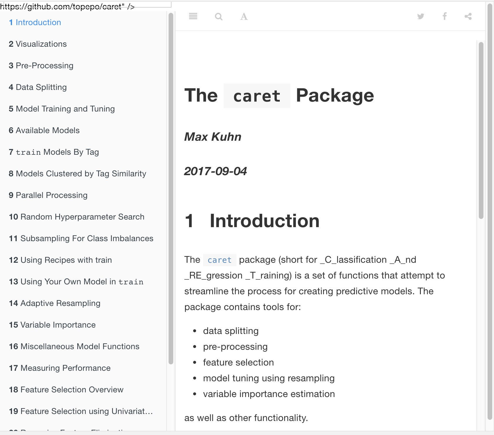

layout: true

<div class="my-footer"><span>
<a href="https://therbootcamp.github.io/"><font color="#7E7E7E">Erfurt, June 2018</font></a>
&emsp;&emsp;&emsp;&emsp;&emsp;&emsp;&emsp;&emsp;&emsp;&emsp;&emsp;&emsp;&emsp;&emsp;&emsp;&emsp;&emsp;
&emsp;&emsp;&emsp;&emsp;&emsp;&emsp;&emsp;&emsp;
&emsp;&emsp;&emsp;&emsp;&emsp;&emsp;&emsp;&emsp;
&emsp;&emsp;&emsp;&emsp;&emsp;
<a href="https://therbootcamp.github.io/"><font color="#646464">www.therbootcamp.com</font></a>
</span></div> 

---
  
```{r, eval = FALSE, echo = FALSE}
# Code to knit slides
xaringan::inf_mr('_sessions/D2S3_MachineLearning/MachineLearning.Rmd')
```


```{r setup, include=FALSE}
options(htmltools.dir.version = FALSE)
# see: https://github.com/yihui/xaringan
# install.packages("xaringan")
# see: 
# https://github.com/yihui/xaringan/wiki
# https://github.com/gnab/remark/wiki/Markdown
options(width=110)
options(digits = 4)

library(tidyverse)
```


# What is machine learning?

.pull-left6[


### Algorithms autonomously learning from data.

Given data, an algorithm tunes its *parameters* to match the data, understand how it works, and make predictions for what will occur in the future.

```{r, echo = FALSE, out.width = "80%", fig.align = 'center'}
knitr::include_graphics("https://raw.githubusercontent.com/therbootcamp/therbootcamp.github.io/master/_sessions/_image/mldiagram_A.png")
```

]

.pull-right4[

```{r, echo = FALSE, out.width = "70%", fig.align = 'center'}
knitr::include_graphics("https://raw.githubusercontent.com/therbootcamp/therbootcamp.github.io/master/_sessions/_image/machinelearningcartoon.png")
```


]

---

# Everyone uses machine learning

.pull-left6[

How does Google know what search results you want?

How does Amazon know what products to recommend?

How does Netflix decide what shows you'll want to watch next?

How do Tesla cars recognize objects and predict accidents?

> Machine learning drives our algorithms for demand forecasting, product search ranking, product and deals recommendations, merchandising placements, fraud detection, translations, and much more. ~ Jeff Bezos, Amazon founder

]


.pull-right4[

```{r, echo = FALSE, out.width = "100%", fig.align = 'center'}
knitr::include_graphics("https://raw.githubusercontent.com/therbootcamp/therbootcamp.github.io/master/_sessions/_image/mlexamples.png")
```

]


---

# What is the basic machine learning process?

```{r, echo = FALSE, out.width = "90%"}
knitr::include_graphics("https://raw.githubusercontent.com/therbootcamp/therbootcamp.github.io/master/_sessions/_image/MLdiagram.png")
```


---

# Why do we separate training from prediction?

.pull-left4[

Just because an algorithm can fit past (training) data well, does *not* necessarily mean that it will *predict* new data well.

Anyone can come up with a model of *past* data (e.g.; stock performance, lottery winnings). Predicting future performance is much more difficult.

> "An economist is an expert who will know tomorrow why the things he predicted yesterday didn't happen today." ~ Evan Esar

]
 
.pull-right6[

```{r, echo = FALSE, out.width = "80%"}
knitr::include_graphics("../_image/prediction_collage.png")
```


]

---

# What do you think?

<font size = 5>Can you come up with a model that will perfectly match past data but is worthless in predicting future data?</font><br><br>


```{r, echo = FALSE}
set.seed(100)
past <- tibble(id = 1:5,
               sex = sample(c("m", "f"), size  = 5, replace = TRUE),
               age = round(rnorm(5, mean = 45, sd = 5), 0),
               fam_history = sample(c("Yes", "No"), size = 5, replace = TRUE),
               smoking = sample(c(TRUE, FALSE), size = 5, replace = TRUE),
               disease = sample(c(0, 1), size = 5, replace = TRUE))

present <- tibble(id = 91:95,
                  sex = sample(c("m", "f"), size  = 5, replace = TRUE),
               age = round(rnorm(5, mean = 45, sd = 5), 0),
               fam_history = sample(c("Yes", "No"), size = 5, replace = TRUE),
               smoking = sample(c(TRUE, FALSE), size = 5, replace = TRUE),
               disease = rep("?", 5))
```

.pull-left45[


### Past "Training" Data
```{r, results = 'asis', echo = FALSE}
knitr::kable(past, format = "markdown")
```

]


.pull-right45[

### Future "Test" Data
```{r, echo = FALSE}
knitr::kable(present, format = "markdown")

```

]


---

## Two types of prediction tasks

.pull-left45[

```{r, echo = FALSE, out.width = "100%", fig.align = 'center'}
knitr::include_graphics("https://raw.githubusercontent.com/therbootcamp/therbootcamp.github.io/master/_sessions/_image/classification_task.png")
```


]


.pull-right45[

```{r, echo = FALSE, out.width = "100%", fig.align = 'center'}
knitr::include_graphics("https://raw.githubusercontent.com/therbootcamp/therbootcamp.github.io/master/_sessions/_image/regression_task.png")
```

]


---

## What machine learning algorithms are there?

.pull-left55[

There are thousands of machine learning algorithms from many different fields.
  - Computer vision, natural language processing, reinforcement learning...

Wikipedia lists 57 *categories* (!) of machine learning algorithms

```{r, echo = FALSE, eval = TRUE, out.width = "80%", fig.align = 'center'}
knitr::include_graphics("https://raw.githubusercontent.com/therbootcamp/therbootcamp.github.io/master/_sessions/_image/wikipediaml.png")
```

]

.pull-right4[
<br><br>

### 3 Algorithims

We will focus on 3 algorithms that apply to most ML tasks:

| Algorithm|Complexity|
|:------|:----|
|     Decision Trees| Low |
|     Regression| Low / Medium | 
|     Random Forests| High |

]


---

# How do you fit and evaluate ML models in R?

.pull-left45[

Answer: Pretty much the same way you fit standard statistical models. Install the package, load, and find the main fitting functions.

```{r, eval = FALSE}
# Install the glmnet package
install.packages("glmnet")

# Load glmnet
library(glmnet)

# Look at help menu
?glmnet
```

Some functions will use the standard `FUN(formula, data)` arguments, but others (like `glmnet()`) require other arguments, like `x, y` (numeric matrices).

The trick is looking at the help file for additional arguments and data requirements

]

.pull-right5[

```{r, echo = FALSE}

```

]

---

## Regression

.pull-left5[

In regression, the criterion is modeled as the weighted sum of predictors times *weights* $\beta_{1}$, $\beta_{2}$

### Loan Default:

One could model the risk of defaulting on a loan as:

$$Risk = Age \times \beta_{age} + Income \times \beta_{income} + ...$$

Training a model means finding values of $\beta_{Age}$ and $\beta_{Income}$ that 'best' match the training data.

```{r, echo = FALSE, eval = TRUE, out.width = "50%", fig.align = 'center'}
knitr::include_graphics("https://raw.githubusercontent.com/therbootcamp/therbootcamp.github.io/master/_sessions/_image/regression.png")
```

]

.pull-right5[

### Standard regression with `glm()`

The `glm()` function in the base stats package performs standard regression.

```{r, eval = FALSE}
glm_mod <- glm(formula = happiness ~ .,
               data = baselers)
```

### Regularised regression with glmnet

To perform regularised regression, which tries to reduce overfitting by penalising large coefficients, use the `glmnet()` package:

```{r, eval = FALSE}
install.packages("glmnet")
library("glmnet")

net_mod <- glmnet(x, # Numeric features
                  y, # Response
                  alpha, # mixing parameter)
```

]

---

## Decision Trees

.pull-left45[

In decision trees, the criterion is modeled as a sequence of logical Yes or No questions.

### Loan Default:

```{r, echo = FALSE, eval = TRUE}
knitr::include_graphics("https://raw.githubusercontent.com/therbootcamp/therbootcamp.github.io/master/_sessions/_image/defaulttree.png")
```


]

.pull-right5[

### Decision trees with rpart

Create decision trees with `rpart`

```{r, eval = FALSE}
install.packages("rpart")
library(rpart)

# Train rpart model
loan_rpart_mod <- rpart(formula, data,
                        method = "class",
                        rpart.control)
```

### Fast-and-frugal trees with FFTrees

Create very simple fast-and-frugal decision trees with `FFTrees`

```{r,eval = FALSE}
install.packages("FFTrees")
library(FFTrees)

loan_FFTrees_mod <- FFTrees(formula, data,
                            max.levels, goal)
```
 

]


---

## Ensemble Decision trees


.pull-left5[


A Random Forest is a collection of many (hundreds, thousands) of decision trees

```{r, echo = FALSE, eval = TRUE, out.width = "90%", fig.cap = "<font size=3><a href='https://medium.com/@williamkoehrsen'>Sourcemedium.com</a></font>"}
knitr::include_graphics("../_image/randomforest_diagram.png")
```

 
]

.pull-right5[

Create a random forest using the `randomForest` package

```{r, eval = FALSE}
# Load the randomforest package
library(randomForest)

# Calculating a randomForest in R
randomForest(formula = y ~.,    # Formula 
             data = data_train, # Training data
             ntree, mtry)       # Optional
```


]

---

## Optimizing model parameters with cross validation

.pull-left45[

Most machine learning models have two types of parameters, *raw parameters* that dictate how an individual model makes predictions, and *meta parameters* that determine how those raw parameters are calculated.

|Model| Raw parameters|Meta parameters|
|:------|:------|:------|
|Decision Trees|Nodes, splits, decisions |Minimum number of cases in each node|
|Regularised regression |Model coefficients | Coefficient penalty term|

To determine 'optimal' meta parameters, which maximize prediction performance, techniques such as cross validation are often used.

]

.pull-right5[

### Cross Validation

```{r, echo = FALSE, out.width = "80%", fig.align = 'center'}
knitr::include_graphics("../_image/crossvalidation.jpg")
```

0) Select *meta parameters*

1) Split the training set into K "folds"

2) Use K - 1 folds for training, and 1 fold for testing.

3) Repeat K times.

4) Average the K testing performances

]


---

.pull-left55[

# Caret

```{r, echo = FALSE, fig.align = 'center', out.width = "30%", eval = FALSE}
knitr::include_graphics("https://vignette.wikia.nocookie.net/joke-battles/images/2/21/Bugs-Bunny-4.png/revision/latest?cb=20151231234917")
```

Caret stands for <b>C</b>lassification <b>A</b>nd <b>RE</b>gression <b>T</b>raining.

`caret` is a 'wrapper' packages that automates much of the the machine learning process.

Do very complex machine learning tasks with a few simple functions

Use any of hundreds of different ML algorithms by changing one "string' (not line!) to use a different model

```{r, eval = FALSE}
library(caret)

train(..., method = "lm") # Regression!
train(..., method = "rf") # Random forests!
train(..., method = "ada") # Boosted trees
```

Knows each model's meta parameters and chooses the best ones for your data using cross validation (or other method).

]

.pull-right4[
<br><br><br>
```{r, echo = FALSE, fig.align = 'center', out.width = "90%", fig.cap = "The almighty Caret!"}
knitr::include_graphics("https://3qeqpr26caki16dnhd19sv6by6v-wpengine.netdna-ssl.com/wp-content/uploads/2014/09/Caret-package-in-R.png")
```

```{r, echo = FALSE, out.width = "100%", fig.align = 'center'}
knitr::include_graphics("https://upload.wikimedia.org/wikipedia/commons/1/1c/K-fold_cross_validation_EN.jpg")
```


]


---
.pull-left5[

# Caret


As always, you can install `caret` from CRAN

```{r, eval = FALSE, echo = TRUE}

# Install caret
install.packages("caret")

# Load the caret package
library("caret")
```

Once you've installed `caret`, look at the vignette for a nice overview of the package

```{r, eval = FALSE}
# Open the main package vignette
vignette("caret")
```

Today we will go over the main functions in the package

]

.pull-right45[

### Caret Vignettes

The `caret` package has some of the *best* documentation (vignettes) you'll ever see.

```{r, echo = FALSE, out.width = "90%"}

```

]

---

.pull-left5[
# Caret

Here are the main functions we will cover in the `caret` package

| Function| Purpose|
|--------|----------|
| `trainControl()` | Determine how training (in general) will be done|
| `train()` | Specify a model and find *best* parameters|
| `varImp()` | Determine variable importance |

]

.pull-right45[

### Caret Vignettes

The `caret` package has some of the *best* documentation (vignettes) you'll ever see.

```{r, echo = FALSE, out.width = "90%"}

```

]

---
.pull-left55[
### trainControl()

Use `trainControl()` to define how `carat` should select the best parameters for any ML model (that you will specify later with `train()`)

Many methods are available in the `method` argument, look at the help menu with `?trainControl` for additional details

```{r, echo = TRUE, out.width = "90%", eval = FALSE}
# Define how caraet should 
#  select best model parameters

ctrl <- trainControl(method = "repeatedcv",
                     number = 10,  # 10 folds
                     repeats = 50) # Repeat 50 times
```

### trainControl methods

|method|Description|
|:----|:----|
|`"repeatedcv"` | Repeated cross-validation|
|`"LOOCV"`| Leave one out cross-validation|
|`"none"` | Fit one model with default parameters |


]

.pull-right4[
<br><br><br><br>
### Cross Validation
```{r, echo = FALSE}
knitr::include_graphics("../_image/crossvalidation.jpg")
```


]

---

.pull-left6[

### train()

- Use `train()` to fit **any** of over 200 models **and** get best parameters

```{r, echo = TRUE, out.width = "90%", eval = FALSE}

train(form = price ~ .,      # Criterion
      data = data_train,     # Training data
      method = "lm",         # Specify a model
      trControl = mycontrol) # Use mycontrol parameters
```

- Specify the criterion to be predicted as a formula with `form`

- Specify training data with `data`

- Choose a model with `method`
    - `method = 'lm'` = Linear regression
    - `method = 'rf` = Random forest

]

.pull-right35[

See all >280 models at [http://topepo.github.io/caret/available-models.html](http://topepo.github.io/caret/available-models.html)

```{r, echo = FALSE}
knitr::include_graphics("caret_models.jpg")
```


]

---

.pull-left5[

# Caret

### varImp()

- Use `varImp()` to extract **variable importance** from a model

```{r, echo = TRUE, out.width = "90%", eval = FALSE}

# Look at variable importance with varImp
varImp(diamonds_lm_train)
```

- Result will be a vector showing how important each variable was in predicting the criterion.

- Specific outputs depend on the model
    - Regression: Regression weights
    - Decision trees: Mean *gini* index.
    
]


.pull-right45[

```{r, echo = FALSE}
knitr::include_graphics("varimp_ss.jpg")
```


]


---


<br><br>
.pull-left5[

# Caret


- There are *many* other great features of caret we haven't touched
   - Splitting data with `createDataPartition()`
   - Imputing (replacing) missing values and transforming predictors with `preProcess()`
   - Add your own custom model
   

- Be sure to check out the **excellent** documentation site to learn all the details


]

.pull-right45[

### http://topepo.github.io/caret/index.html


```{r, echo = FALSE}

```

]

---

## Machine Learning II Live Demo & Practical

<p><font size=6><b><a href="https://therbootcamp.github.io/BaselRBootcamp_2018April/_sessions/D3S1_MachineLearningII/MachineLearningII_practical.html">Link to Machine Learning II practical</a>


---

## Machine Learning Live Demo & Practical

<p><font size=6><b><a href="https://therbootcamp.github.io/BaselRBootcamp_2018April/_sessions/D2S3_MachineLearning/MachineLearning_practical.html">Link to Machine Learning practical</a>


<!-- --- -->
<!-- # What is the history of machine learning? -->

<!-- - 1805 - 1809: Legendre and Gauss discover least squares. Soon after Galton defines **Regression** in a biological context, followed by Pearson for purely statistical analyses. -->

<!-- - 1952: Arthur Samuel creates first computer learning program for learning checkers and coins the term **Machine Learning** in 1959.  -->

<!-- - 1957: Frank Rosenblatt creates first **Neural Network** to simulate the thought process of the human brain. -->

<!-- - 1963: First algorithm for **Support Vector Machines** is developed by Vapnik & Chervonenkis. -->

<!-- - 1967: **Nearest neighbor algorithm** is developed for classification -->

<!-- - 1984: Breiman & Olshen publish the CART algorithm for **Decision Trees**, followed by Quinlan who publishes the ID3 algorithm followed by C4.5 -->

<!-- - 1986: Rina Dechter introduces **Deep Learning**, with many subsequent updates in the 2000s. -->

<!-- - 1995: Tin Kam Ho develops first algorithm for **Random Forests** -->

<!-- Sources: Wikipedia, Bernard Marr, "A Short History of Machine Learning", Forbes. -->


---
### Old


---
# Why do we separate training from prediction?

- Data comes from two processes: *Signal* and *Noise* (aka Error).
<br>

```{r, echo = FALSE, fig.width = 7, fig.height = 3, dpi=200, out.width = "80%", fig.align = 'center'}

set.seed(100)
x <- seq(0, 5, length.out = 50)
noise <- rnorm(50, mean = 0, sd = 2.5)

model_fun <- function(x) {x ^ 3 - 4 * x ^ 2 + .5 * x + 5}

y <- model_fun(x)
y_obs <- model_fun(x) + noise

par(mar = c(3, 4, 3, 1))

par(mfrow = c(1, 3))

plot(x, y_obs, main = "Data", xlab = "", ylab = "", col = "black")

# segments(x, y, x, y_obs)

# lines(y, y = y_obs)


# Plot 1

plot(x, y_obs, main = "Signal", xlab = "", ylab = "", col = "lightgray")
curve(model_fun, from = 0, to = 5, add = TRUE, col = "green", lwd = 2)

# segments(x, y, x, y_obs)

# lines(y, y = y_obs)


# Plot 2

plot(x, y_obs, main = "Noise", xlab = "", ylab = "")
 curve(model_fun, from = 0, to = 5, add = TRUE, col = "darkgray", lwd = .5)

 segments(x, y, x, y_obs)

# lines(y, y = y_obs)


# 
# # Plot 3
# 
# plot(x, y_obs, main = "A bad model tries to fit everything", xlab = "", ylab = "")
# curve(model_fun, from = 0, to = 5, add = TRUE, col = "darkgray", lwd = .5)
# 
# text(.5, 20, "Hey I can draw a line through all points\nI don't have any error!", adj = 0)
# 
# 
# lines(x, y_obs)
# 
# # Plot 4
# 
# plot(x, y_obs, main = "A good model will try to focus on the signal", xlab = "", ylab = "")
# curve(model_fun, from = 0, to = 5, add = TRUE, col = "blue", lwd = 2)
# 
# text(.5, 20, "I won't try to fit all points because\nI think there is random error", adj = 0)


# lines(x, y_obs)


```


---
# Why do we separate training from prediction?

- A good model is one that tries to capture the signal and ignore the noise
- A bad model is one that captures too much unpredictable noise,
    

```{r, echo = FALSE, fig.width = 7, fig.height = 3, dpi=200, out.width = "80%", fig.align = 'center'}

set.seed(100)
x <- seq(0, 5, length.out = 50)
noise <- rnorm(50, mean = 0, sd = 2.5)

model_fun <- function(x) {x ^ 3 - 4 * x ^ 2 + .5 * x + 5}

y <- model_fun(x)
y_obs <- model_fun(x) + noise

par(mar = c(3, 4, 3, 1))

par(mfrow = c(1, 3))

plot(x, y_obs, main = "Data", xlab = "", ylab = "", col = "black")

# segments(x, y, x, y_obs)

# lines(y, y = y_obs)


# Plot 1

plot(x, y_obs, main = "Good Model", xlab = "", ylab = "", col = "darkgray")

lines(x, y, col = "blue")

# curve(model_fun, from = 0, to = 5, add = TRUE, col = "green", lwd = 2)

text(.5, 20, "Fitting error = Medium", adj = 0)
text(.5, 15, "Prediction error = Low", adj = 0)


# segments(x, y, x, y_obs)

# lines(y, y = y_obs)


# Plot 2

plot(x, y_obs, main = "Bad Model", xlab = "", ylab = "")

text(.5, 20, "Fitting error = None", adj = 0)
text(.5, 15, "Prediction error = High", adj = 0)


lines(x, y_obs, col = "red")
# lines(y, y = y_obs)


# 
# # Plot 3
# 
# plot(x, y_obs, main = "A bad model tries to fit everything", xlab = "", ylab = "")
# curve(model_fun, from = 0, to = 5, add = TRUE, col = "darkgray", lwd = .5)
# 
# text(.5, 20, "Hey I can draw a line through all points\nI don't have any error!", adj = 0)
# 
# 
# lines(x, y_obs)
# 
# # Plot 4
# 
# plot(x, y_obs, main = "A good model will try to focus on the signal", xlab = "", ylab = "")
# curve(model_fun, from = 0, to = 5, add = TRUE, col = "blue", lwd = 2)
# 
# text(.5, 20, "I won't try to fit all points because\nI think there is random error", adj = 0)


# lines(x, y_obs)


```


